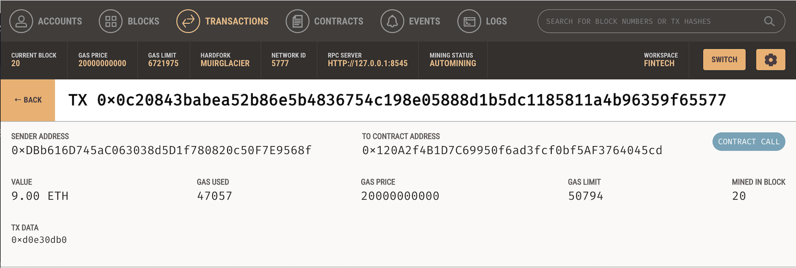
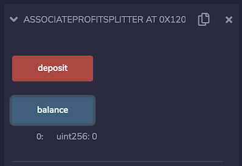

# Level One: The `AssociateProfitSplitter` Contract

This smart contract will accept Ether into the contract and divide the Ether evenly among the associate level employees. This will allow the Human Resources department to pay employees quickly and efficiently. 

The main steps in building this smart contract are the following:

   * Define your 3 `public` variables that represent each employee and make sure each of them are set to `payable`. 

   * Create a constructor function that accepts wallet addresses for each employee. This prevents the user from having to hardcode the employee addresses into the smart contract.

   * Create a `balance` function that returns the contract's current balance. Since we should always be sending Ether to the beneficiaries, this function should always return `0`. 

   * Create a `deposit` function set to `public payable` check, ensuring that only the owner can call the function.

       * Set a `uint amount` to equal `msg.value / 3;` in order to calculate the split value of the Ether.

       * Transfer the `amount` to `employee_one`, `employee_two` and `employee_three`

       * Transfer any remaining `wei` back to the Human Resources or in this case `msg.sender`
    
   * Lastly, create a fallback function using `function() external payable`, and called the `deposit` function from within it. This will ensure that the logic in `deposit` executes if Ether is sent directly to the contract. This is important to prevent Ether from being locked in the contract since we don't have a `withdraw` function in this use-case.

Below is a link to the Solidity code for this Level 1: Associate Profit Splitter Contract:

* [`AssociateProfitSplitter.sol`](Starter-Code/AssociateProfitSplitter.sol) -- Level 1 Code.

## Testing The Level1: Associate Profit Splitter Contract

In the `Deploy` tab in Remix, deploy the contract to your local Ganache chain by connecting to `Injected Web3` and ensuring MetaMask is pointed to `localhost:8545`. Select the account in your Metamask Wallet that you would like to represent your Human Resources department. At the top left of your MetaMask wallet it should say `Connected`, meaning you are connected to Remix and readt to `Deploy` your contract on your local Ganache chain. 

Next, you will need to fill in the constructor parameters in Remix with your designated `employee` addresses and then click `transact` to deploy the smart contract. 

Now that we have deployed our contract, we can `deposit` Ether by sending various values. In the `Value` box enter the amount you wish to `deposit` and the denomination (the default is set `wei`). Then click `deposit` and you should be prompted to `confirm` the transaction in MetaMask. Once you hit confirm, keep an eye on the `employee` balances as you send different amounts of Ether to the contract. Ensure the logic is executing properly and check that the contract balance is still `zero`. Below are various screenshots showing a successful transaction:

## Initial Account Balances 
The first highlighted account represents our Human Resources department with a starting balance of `93.45ETH`. The three highlighted accounts below that represent our three employees, which all have a starting balance of `100ETH`.

Human Resource (Account 4) Address: `0xDBb616D745aC063038d5D1f780820c50F7E9568f`

Employee One Address: `0x6d1DA4e220D85Dd59B0CDd00f6F4FcCDDa706b24`

Employee Two Address: `0x36f29C56405bB27029FE3aa35512252AF20Bf1D0`

Employee Three Address: `0xa3d99926025008A71a1518E3d72fC15647bdF598`

## Confirm MetaMask Deposit
After clicking `deposit`, you will be prompted to `confirm` the deposit in MetaMask. 

## Final Accounts Balances 
After depositing the money, we can see that the Human Resource account decreased by `9ETH` plus `gas fees` for executing the contract. The balances for all three employees increassed from `100ETH` to `103ETH`. 

## Transaction ID
We can also lookup the transaction details in Ganache using the TX hash number. This shows who sent the transaction and the contract address. The `Value` of the transaction, details about `gas prices` and the `Block Number` 

## Final Contract Balance
Lastly, we can check that the remaining balance of our smart contract is `zero`.

