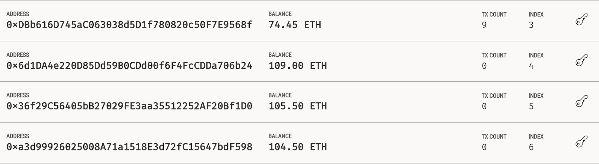

# Level 2: The `TieredProfitSplitter` Contract

The  `TieredProfitSplitter` contract when executed will distribute different percentages of deposited `Ether` to employees at different tiers/levels. In this contract, rather than splitting the profits between Associate-level employees, the profits are different percentages for different tiers of employees (CEO, CTO, and CFO). For example, the CEO gets paid 60%, CTO 25%, and CFO gets 15%.

The steps are similar to our Level 1 contract in terms of defining our employee variables, adding a constructor, contract balance function, etc. The main changes come within our `deposit` function:

* First, we need to calculate the number of points/units by dividing `msg.value` by `100`.

   * This will allow us to multiply the points with a number representing a percentage. For example, `points * 60` will output a number that is `~60%` of the `msg.value`.

* The `uint amount` variable will be used to store the amount to send each employee temporarily. For each employee, set the `amount` to equal the number of `points` multiplied by the percentage (say, 60 for 60%).

* After calculating the `amount` for the first employee, add the `amount` to the `total` to keep a running total of how much of the `msg.value` we are distributing so far.

* Then, transfer the `amount` to `employee_one`, and repeated the steps for each employee, setting the `amount` to equal the `points` multiplied by their given percentage.

* The transfers were structured in the below format for each employee, until after transferring to the third employee:

  * Step 1: `amount = points * 60;`

    * For `employee_one`, distribute `points * 60`.

    * For `employee_two`, distribute `points * 25`.

    * For `employee_three`, distribute `points * 15`.

  * Step 2: `total += amount;`

  * Step 3: `employee_one.transfer(amount);`

* It sends the remainder to the employee with the highest percentage by subtracting `total` from `msg.value`, and sending that to an employee.

Below is a link to the Solidity code for this Level 2: `TieredProfitSplitter` Contract:

* [`TieredProfitSplitter.sol`](Starter-Code/TieredProfitSplitter.sol) -- Level 2 Code

### Testing Level 2: Tiered Profit Splitter Contract

Similar to our Level 1 contract, we can follow the steps to `Deploy` our `Level 2 - Tiered Profit Splitter Contract` on our local Ganache chain. We will again need to input our constructor parameters in Remix with your designated `employee` addresses and then click `transact` to deploy the smart contract. 

  * Note: Amount deposited needs to be greater than `100 wei`. The `100 wei` threshold is due to the way we calculate the points. If we send less than 100 wei, for example, 80 wei, `points` would equal `0` because `80 / 100` equals `0` because the remainder is discarded.

### Initial Account Balances 
The first highlighted account represents our Human Resources department with a starting balance of `84.45ETH`. The three highlighted accounts below that represent our three employees, which all have a starting balance of `103ETH`.

Human Resource (Account 4) Address: `0xDBb616D745aC063038d5D1f780820c50F7E9568f`

Employee One (CEO) Address: `0x6d1DA4e220D85Dd59B0CDd00f6F4FcCDDa706b24`

Employee Two (CTO) Address: `0x36f29C56405bB27029FE3aa35512252AF20Bf1D0`

Employee Three (CFO) Address: `0xa3d99926025008A71a1518E3d72fC15647bdF598`

### Confirm MetaMask Deposit
After clicking `deposit`, you will be prompted to `confirm` the deposit in MetaMask. 

### Final Accounts Balances 
After depositing the money, we can see that the Human Resource account decreased by `10ETH` plus `gas fees` for executing the contract. The balances for all three employees increassed as follows:

Employee One (CEO) Balance: `103 ETH` to `109 ETH`              (`10ETH * 60% = 6ETH`)

Employee Two (CTO) Balance: `103 ETH` to `105.5 ETH`            (`10ETH * 25% = 2.5ETH`)

Employee Three (CFO) Balance: `103 ETH` to `104.5 ETH`    (`10ETH * 15% = 1.5ETH`)

### Transaction ID
We can also lookup the transaction details in Ganache using the TX hash number. This shows who sent the transaction and the contract address. The `Value` of the transaction, details about `gas prices` and the `Block Number` 

### Final Contract Balance
Lastly, we can check that the remaining balance of our smart contract is `zero`.

