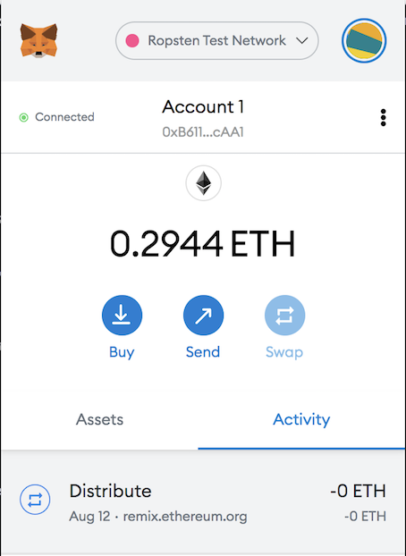

# Level 3: The `DeferredEquityPlan` Contract

The `DeferredEquityPlan` contract models a traditional company stock plan. This contract will automatically manage a 1000 shares with an annual distribution of 250 over 4 years for a single employee.

This contract manages an employee's "deferred equity incentive plan" in which 1000 shares will be distributed over 4 years to the employee. We won't need to work with Ether in this contract, but we will be storing and setting amounts that represent the number of distributed shares the employee owns and enforcing the vetting periods automatically.


The main components of the contract include:

* Human Resources will be set in the constructor as the `msg.sender`, since HR will be deploying the contract.

* Below the `employee` initialization variables at the top (after `bool active = true;`), set the total shares and annual distribution:

  * Create a `uint` called `total_shares` and set this to `1000`.

  * Create another `uint` called `annual_distribution` and set this to `250`. This equates to a 4 year vesting period for the `total_shares`, as `250` will be distributed per year. Since it is expensive to calculate this in Solidity, we can simply set these values manually. You can tweak them as you see fit, as long as you can divide `total_shares` by `annual_distribution` evenly.

* The `uint start_time = now;` line permanently stores the contract's start date. We'll use this to calculate the vested shares later. Below this variable, set the `unlock_time` to equal `now` plus `365 days`. We will increment each distribution period.

* The `uint public distributed_shares` will track how many vested shares the employee has claimed and was distributed. By default, this is `0`.

* In the `distribute` function:

  * Add the following `require` statements:

    * Require that `unlock_time` is less than or equal to `now`.

    * Require that `distributed_shares` is less than the `total_shares` the employee was set for.

    * Ensure to provide error messages in your `require` statements.

  * After the `require` statements, add `365 days` to the `unlock_time`. This will calculate next year's unlock time before distributing this year's shares. We want to perform all of our calculations like this before distributing the shares.

  * Next, set the new value for `distributed_shares` by calculating how many years have passed since `start_time` multiplied by `annual_distributions`. For example:

    * The `distributed_shares` is equal to `(now - start_time)` divided by `365 days`, multiplied by the annual distribution. If `now - start_time` is less than `365 days`, the output will be `0` since the remainder will be discarded. If it is something like `400` days, the output will equal `1`, meaning `distributed_shares` would equal `250`.

    * Make sure to include the parenthesis around `now - start_time` in your calculation to ensure that the order of operations is followed properly.

  * The final `if` statement provided checks that in case the employee does not cash out until 5+ years after the contract start, the contract does not reward more than the `total_shares` agreed upon in the contract.

  * For this contract, test the timelock functionality by adding a new variable called `uint fakenow = now;` as the first line of the contract, then replace every other instance of `now` with `fakenow`. Utilize the following `fastforward` function to manipulate `fakenow` during testing.

  * Add this function to "fast forward" time by 100 days when the contract is deployed (requires setting up `fakenow`):

    ```solidity
    function fastforward() public {
        fakenow += 100 days;
    }
    ```

  * Once you are satisfied with your contract's logic, revert the `fakenow` testing logic.


### Deploy the contracts to a live Testnet

For this contract, we can deploy it on the Kovan or Ropsten network by swithcing to either network in our MetaMask wallet. We will need some test Ether in our account in order to deploy and execute the contract.  

After switching MetaMask to Ropsten, deploy the contracts as before and copy/keep a note of the deployed address. The transactions will also be in your MetaMask history, and on the blockchain permanently to explore later. Below are a few screenshots of a successful contract deployment. 

## Deploy Contract
Insert the address of the employee that will be recieving the distributed shares. 

 


## MetaMask Confirmation
At the top of your MetaMask wallet, you can check that you are connected to the correct network. 


## Distribute First 250 Shares
You can check to see if any shares have been distributed in your contract. The balance should be `zero`. You can then click `distribute` to distribute the first 250 Shares. The MetaMask prompt will then appear to confirm the transaction and gas fee. 


## Distribution Receipt in MetaMask




## FastFoward Execution

We can then click `fastforward` to speed up time and test the second round of share distribution. Below is the MetaMask FastForward receipt.  


##Etherscan Transaction Address:

Contract Deployment - TX Hash: [0xc0f21f174bae47894d66a4c7b452216cbb58940363179126347b9dd5cd1dfb98](https://ropsten.etherscan.io/tx/0xc0f21f174bae47894d66a4c7b452216cbb58940363179126347b9dd5cd1dfb98)

Distribution 1 - TX Hash:  [0x5e7cb8d76a18cf25d3fdd56546e3439128d60e6be53da04717f2727e37890c9d](https://ropsten.etherscan.io/tx/0x5e7cb8d76a18cf25d3fdd56546e3439128d60e6be53da04717f2727e37890c9d)

Fastforward - TX Hash: [0x9a3f3517a9369f620ba490c2867bb6e50e7a235a98d18d37dece2f7e53dcc2c4](https://ropsten.etherscan.io/tx/0x9a3f3517a9369f620ba490c2867bb6e50e7a235a98d18d37dece2f7e53dcc2c4)
